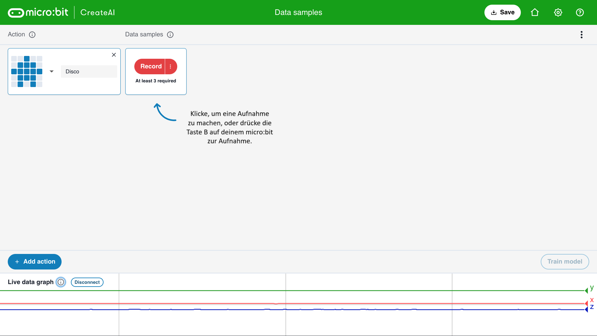

## Füge Beispiele hinzu

<html>
  

    <iframe style="position: absolute; top: 0; left: 0; right: 0; width: 100%; height: 100%; border: none;" src="https://www.youtube.com/embed/wCOEoAI2X28?rel=0&cc_load_policy=1" allowfullscreen allow="accelerometer; autoplay; clipboard-write; encrypted-media; gyroscope; picture-in-picture; web-share"></iframe>
  

</html>

### Füge eine Aktion hinzu

\--- task ---

Klicke auf den blauen **+ Add action** Knopf.

Benenne die **erste** Aktion.

Unser Beispiel verwendet den Namen „Disco“.

\--- /task ---

### Füge Datensätze hinzu

Es ist wichtig, dass du den micro:bit immer auf die gleiche Weise hältst.

\--- task ---

Halte deinen micro:bit und das Akkupack zusammen in deiner Hand fest.

**Merke** dir, wie du ihn hältst. Stelle sicher, dass du sie später in diesem Projekt genauso hältst.

\--- /task ---

Jede Aktion kann 1 Sekunde lang sein.

\--- task ---

Drücke die Taste B, warte den Countdown ab und nehme dann deine erste 1-Sekunden-Aktion auf.

Dieses Beispiel zeigt eine „Disco“-Aktion, du kannst jedoch jede beliebige Aktion aufnehmen!

<video width="360" height="640" controls>
  <source src="images/disco.mp4" type="video/mp4" alt="A video of young person recording samples of a dance move">Dein Browser unterstützt dieses Video-Element nicht.</video>

\--- /task ---

\--- task ---

Erstelle weitere Aufnahmen für deine erste Aktion, bis du mindestens **10 Aufnahmen** hast.

\--- /task ---

### Füge eine zweite Aktion hinzu

\--- task ---

Klicke auf den blauen **+ Add action** Knopf.

Benenne die **zweite** Aktion.

Unser Beispiel verwendet den Namen „Floss“ (Zahnseide).

\--- /task ---

\--- task ---

Füge Aufnahmen von deiner zweiten Aktion hinzu, bis du mindestens **10 Aufnahmen** hast.

Dieses Beispiel zeigt eine „Floss“-Aktion, du kannst jedoch jede beliebige Aktion aufnehmen!

<video width="360" height="640" controls>
  <source src="images/floss.mp4" type="video/mp4" alt="A video of young person recording samples of a dance move">Dein Browser unterstützt dieses Video-Element nicht.</video>

\--- /task ---
