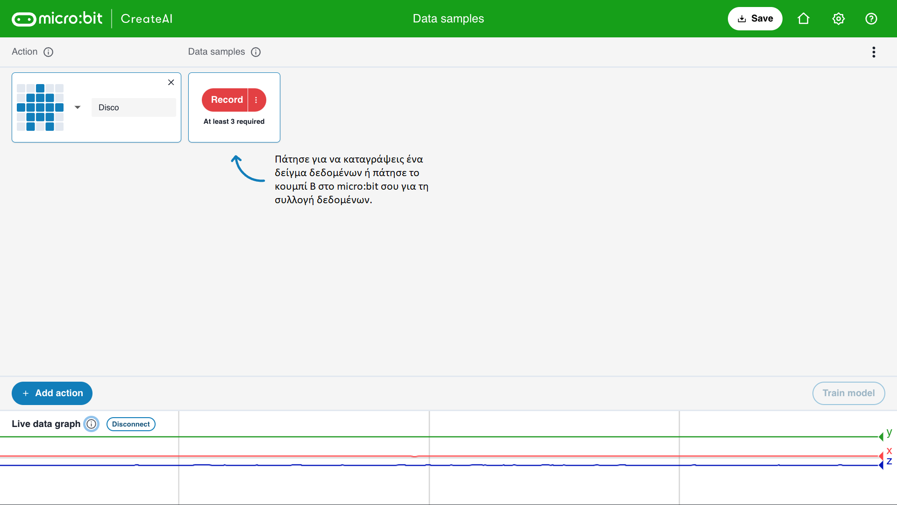

## Πρόσθεσε δείγματα

<html>
  

    <iframe style="position: absolute; top: 0; left: 0; right: 0; width: 100%; height: 100%; border: none;" src="https://www.youtube.com/embed/wCOEoAI2X28?rel=0&cc_load_policy=1" allowfullscreen allow="accelerometer; autoplay; clipboard-write; encrypted-media; gyroscope; picture-in-picture; web-share"></iframe>
  

</html>

### Πρόσθεσε μία ενέργεια

\--- task ---

Κάνε κλικ στο μπλε κουμπί **+ Add action**.

Ονόμασε την **πρώτη** ενέργεια.

Το παράδειγμά μας χρησιμοποιεί το όνομα `Disco`.

\--- /task ---

### Πρόσθεσε δείγματα δεδομένων

Είναι σημαντικό να κρατάς πάντα το micro:bit με τον ίδιο τρόπο.

\--- task ---

Κράτησε το micro:bit και την μπαταρία μαζί στο χέρι σου.

**Θυμήσου** πώς το κρατάς. Βεβαιώσου ότι θα το κρατήσεις έτσι αργότερα σε αυτό το έργο.

\--- /task ---

Κάθε ενέργεια μπορεί να έχει διάρκεια 1 δευτερόλεπτο.

\--- task ---

Πάτησε το κουμπί B, περίμενε την αντίστροφη μέτρηση και, στη συνέχεια, κάνε την πρώτη σου ενέργεια 1 δευτερολέπτου.

Αυτό το παράδειγμα δείχνει μια ενέργεια `Disco`, αλλά μπορείς να κάνεις όποια ενέργεια θέλεις!

<video width="360" height="640" controls>
  <source src="images/disco.mp4" type="video/mp4" alt="A video of young person recording samples of a dance move">
  
Your browser does not support the video tag.
</video>

\--- /task ---

\--- task ---

Πρόσθεσε περισσότερα δείγματα της πρώτης σου ενέργειας, μέχρι να έχεις τουλάχιστον **10 δείγματα**.

\--- /task ---

### Πρόσθεσε μία δεύτερη ενέργεια

\--- task ---

Κάνε κλικ στο μπλε κουμπί **+ Add action**.

Ονόμασε την **δεύτερη** ενέργεια.

Το παράδειγμά μας χρησιμοποιεί το όνομα `Floss`.

\--- /task ---

\--- task ---

Πρόσθεσε δείγματα της δεύτερης σου ενέργειας, μέχρι να έχεις τουλάχιστον **10 δείγματα**.

Αυτό το παράδειγμα δείχνει μια ενέργεια `Floss`, αλλά μπορείς να κάνεις όποια ενέργεια θέλεις!

<video width="360" height="640" controls>
  <source src="images/floss.mp4" type="video/mp4" alt="A video of young person recording samples of a dance move">
  
Your browser does not support the video tag.
</video>

\--- /task ---
