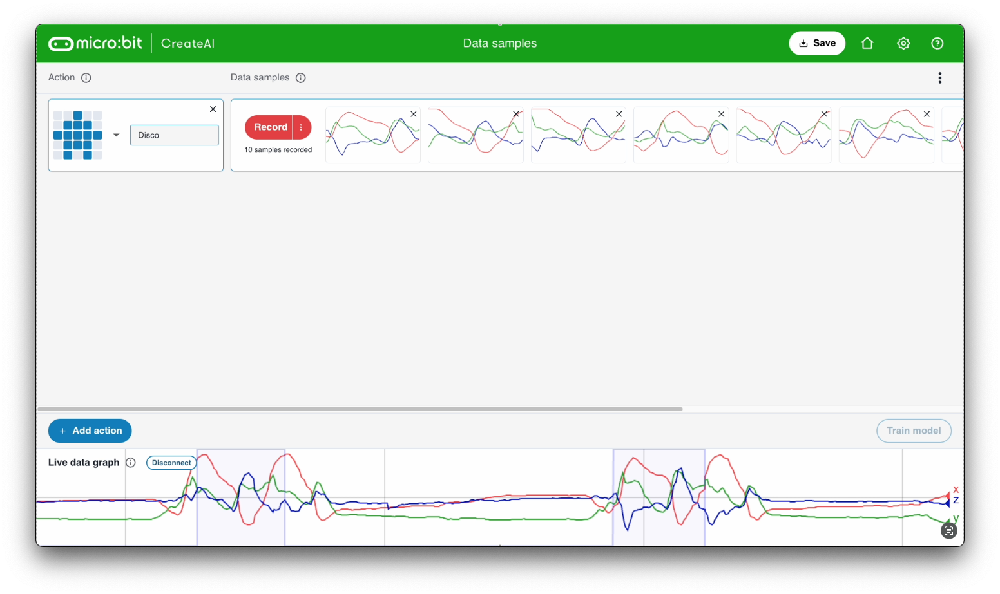

## Step-by-step guide

### Create a new session

You will use an online machine learning platform.

--- task ---

Open [https://ml.microbit.org](https://ml.microbit.org).

--- /task ---

You will use your micro:bit to sense your movements and send the data to the online machine learning platform.

--- task ---

Click **Start new session** and follow the instructions to set up your micro:bit.

--- /task ---

### Add an action

--- task ---

Name the **first** action.

Our example uses the name `Disco`.

--- /task ---

### Add data samples

--- task ---

Connect your micro:bit to battery power.

--- /task ---

--- collapse ---
---
title: I do not have a battery pack
---

You can keep your micro:bit connected using USB, but the cable needs to be long enough to allow you to move freely with it.

--- /collapse ---

It is important you always hold the micro:bit the same way.

--- task ---

Hold you micro:bit and battery pack together in your hand. 

Keep your thumb along the logo edge and hold it so the logo is pointing towards you and the long edge is nearest your body.

<video width="480" height="640" controls>
  <source src="images/hold.mp4" type="video/mp4" alt="Video showing how to hold the micro:bit">
Your browser does not support the video tag.
</video>

--- /task ---

Each action can be 2 seconds long.

--- task ---

Press button B, wait for the countdown, then make your first 2-second action.

This example shows a `Disco` action - but you can do whatever action you want!

<video width="480" height="640" controls>
  <source src="images/disco.mp4" type="video/mp4" alt="A video of young person recording samples of a dance move">
Your browser does not support the video tag.
</video>

--- /task ---

--- task ---

Add more samples of your first action, until you have at least **10 samples**.

--- /task ---

### Add a second action

--- task ---

Click the blue `+Add action` button.

Name the **second** action.

Our example uses the name `Floss`.

--- /task ---

--- task ---

Add samples of your second action, until you have at least **10 samples**.

This example shows a `Floss` action - but you can do whatever action you want!

<video width="480" height="640" controls>
  <source src="images/floss.mp4" type="video/mp4" alt="A video of young person recording samples of a dance move">
Your browser does not support the video tag.
</video>

--- /task ---

### Train model

### Test model

Gather images of `five` fingers.

--- task ---

- Click **Webcam** in the `Five` class
- Hold up five fingers to your webcam (make sure your whole hand is in view)
- With your other hand, press and hold the **Hold to Record** button to gather lots of images

--- /task ---

Gather images of `three` fingers.

--- task ---

- Click **Webcam** in the `Three` class
- Hold up three fingers to your webcam (make sure your whole hand is in view)
- With your other hand, press and hold the **Hold to Record** button to gather lots of images

--- /task ---

### Train the model

--- task ---

Click the blue **Train model** button.

Click the blue **Train model** button on the new page, too.

--- /task ---

<video width="640" height="480" controls>
  <source src="images/train.mp4" type="video/mp4" alt="A screen recording showing the model training progress">
Your browser does not support the video tag.
</video>

### Preview and test

See if your model can recognise your dance moves!

--- task ---

Perform one of your actions and see what your model predicts (**estimates**) the action is. 

You will see confidence (**certainty**) scores for your actions.

--- /task ---

<video width="640" height="480" controls>
  <source src="images/discotest.mp4" type="video/mp4" alt="A screen recording showing the estimated action during testing">
Your browser does not support the video tag.
</video>
