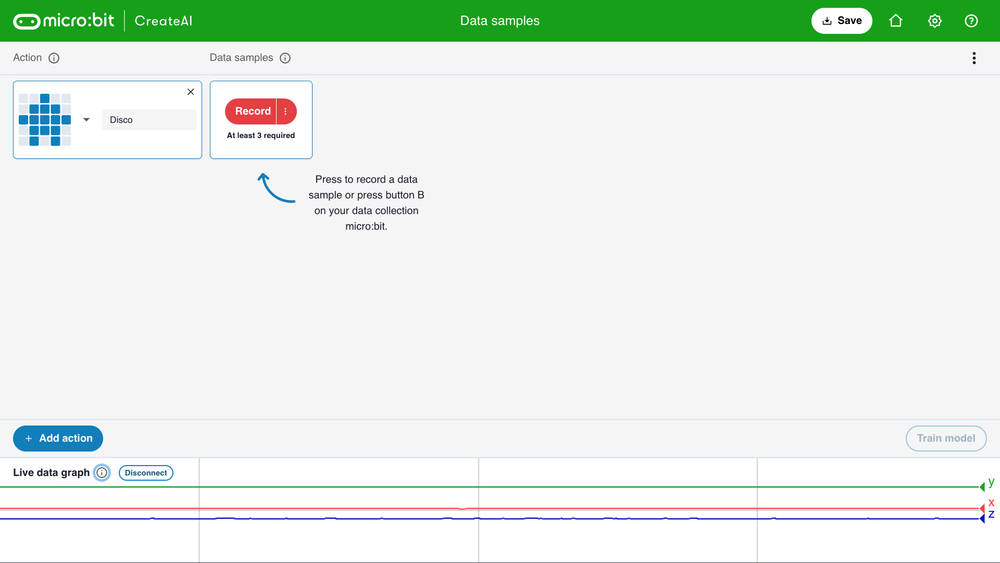

## Agrega muestras

<html>
  

    <iframe style="position: absolute; top: 0; left: 0; right: 0; width: 100%; height: 100%; border: none;" src="https://www.youtube.com/embed/wCOEoAI2X28?rel=0&cc_load_policy=1" allowfullscreen allow="accelerometer; autoplay; clipboard-write; encrypted-media; gyroscope; picture-in-picture; web-share"></iframe>
  

</html>

### Añadir una acción

\--- task ---

Haga clic en el botón azul **+ Agregar acción**.

Nombra la **primera** acción.

Nuestro ejemplo usa el nombre `Disco`.

\--- /task ---

### Añadir muestras de datos

Es importante que siempre sostengas el micro:bit de la misma manera.

\--- task ---

Hold your micro:bit and battery pack together in your hand.

**Recuerda** cómo lo sostienes. Asegúrate de sostenerlo así luego en este proyecto.

\--- /task ---

Cada acción puede durar 1 segundo.

\--- task ---

Presione el botón B, espere la cuenta regresiva y luego realice su primera acción de 1 segundo.

Este ejemplo muestra una acción 'Disco', ¡pero puedes hacer cualquier acción que quieras!

<video width="360" height="640" controls>
  <source src="images/disco.mp4" type="video/mp4" alt="A video of young person recording samples of a dance move">
Tu navegador no es compatible con el elemento audio
</video>

\--- /task ---

\--- task ---

Añade más muestras de tu primera acción, hasta que tengas al menos **10 muestras**.

\--- /task ---

### Añadir una segunda acción

\--- task ---

Haga clic en el botón azul **+ Agregar acción**.

Nombra la **segunda** acción.

Nuestro ejemplo utiliza el nombre "Floss".

\--- /task ---

\--- task ---

Añade muestras de tu segunda acción, hasta que tengas al menos **10 muestras**.

Este ejemplo muestra una acción 'Floss', ¡pero puedes hacer cualquier acción que quieras!

<video width="360" height="640" controls>
  <source src="images/floss.mp4" type="video/mp4" alt="A video of young person recording samples of a dance move">
  
Su navegador no soporta la etiqueta de vídeo.
</video>

\--- /task ---
