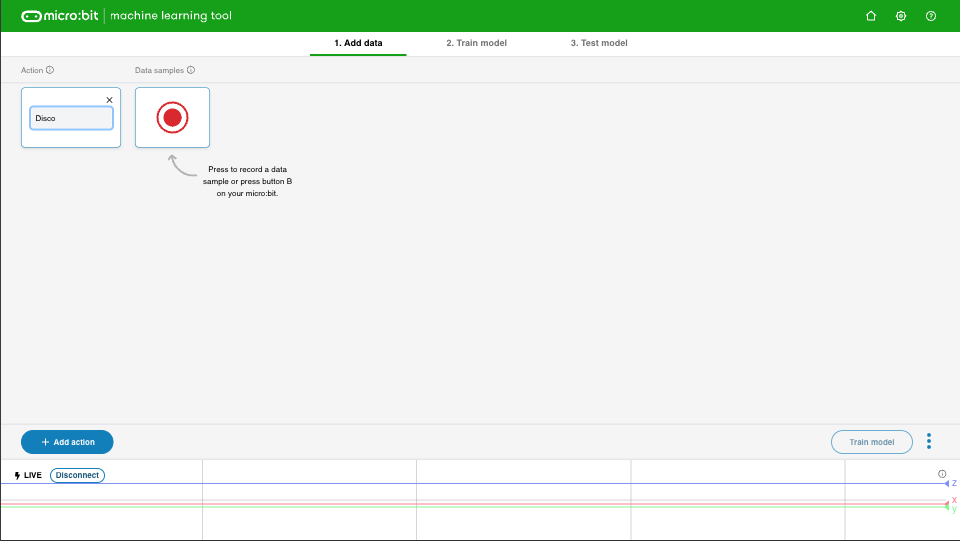
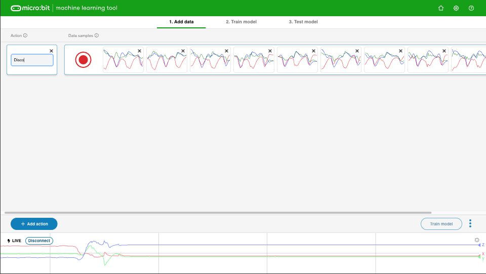

## Ajouter des échantillons

<html>
  

    <iframe style="position: absolute; top: 0; left: 0; right: 0; width: 100%; height: 100%; border: none;" src="https://www.youtube.com/embed/wCOEoAI2X28?rel=0&cc_load_policy=1" allowfullscreen allow="accelerometer; autoplay; clipboard-write; encrypted-media; gyroscope; picture-in-picture; web-share"></iframe>
  

</html>

### Ajouter une action

\--- task ---

Clique sur le bouton bleu **+ Add action**.

Nomme **la première** action.

Nous utilisons le nom `Disco` comme exemple.

\--- /task ---

### Ajouter des échantillons de données

Il est important que tu tiennes toujours le micro:bit de la même manière.

\--- task ---

Tiens ton micro:bit et ta batterie ensemble dans ta main.

**Souviens-toi** de la façon dont tu le tiens. Assure-toi de le tenir de la même façon plus tard dans ce projet.

\--- /task ---

Chaque action peut être de 1 seconde.

\--- task ---

Appuie sur le bouton B, attends le compte à rebours, puis fais ta première action de 1 seconde.

Cet exemple montre une action `Disco`, mais tu peux faire ce que tu veux !

<video width="360" height="640" controls>
  <source src="images/disco.mp4" type="video/mp4" alt="A video of young person recording samples of a dance move">
  
Ton navigateur ne prend pas en charge la balise vidéo.
</video>

\--- /task ---

\--- task ---

Ajoute plus d'échantillons de ta première action, jusqu'à ce que tu aies au moins **10 échantillons**.

\--- /task ---

### Ajouter une deuxième action

\--- task ---

Clique sur le bouton bleu **+ Add action**.

Nomme la **deuxième** action.

Nous utilisons le nom `Floss` comme exemple.

\--- /task ---

\--- task ---

Ajoute des échantillons de ta deuxième action, jusqu'à ce que tu aies au moins **10 échantillons**.

Cet exemple montre une action `Floss`, mais tu peux faire ce que tu veux !

<video width="360" height="640" controls>
  <source src="images/floss.mp4" type="video/mp4" alt="A video of young person recording samples of a dance move">
  
Ton navigateur ne prend pas en charge la balise vidéo.
</video>

\--- /task ---
