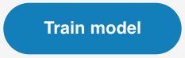

## Entraîner le modèle

<html>
  

    <iframe style="position: absolute; top: 0; left: 0; right: 0; width: 100%; height: 100%; border: none;" src="https://www.youtube.com/embed/2VC3gnPk3Zw?rel=0&cc_load_policy=1" allowfullscreen allow="accelerometer; autoplay; clipboard-write; encrypted-media; gyroscope; picture-in-picture; web-share"></iframe>
  

</html>

--- task ---

Clique sur le bouton bleu **Train model**.

--- /task ---

### Prévisualiser et tester

Vois si ton modèle peut reconnaître tes mouvements de danse !

--- task ---

Effectue l'une de tes actions et vois ce que ton modèle prédit (**estimation**) de l'action.

Tu verras des scores de confiance (**certitude**) pour tes actions.

--- /task ---

<video width="640" height="360" controls>
  <source src="images/discotest.mp4" type="video/mp4" alt="A screen recording showing the estimated action during testing with an overlay of a boy performing the dance move">
Ton navigateur ne prend pas en charge la balise vidéo.
</video>
