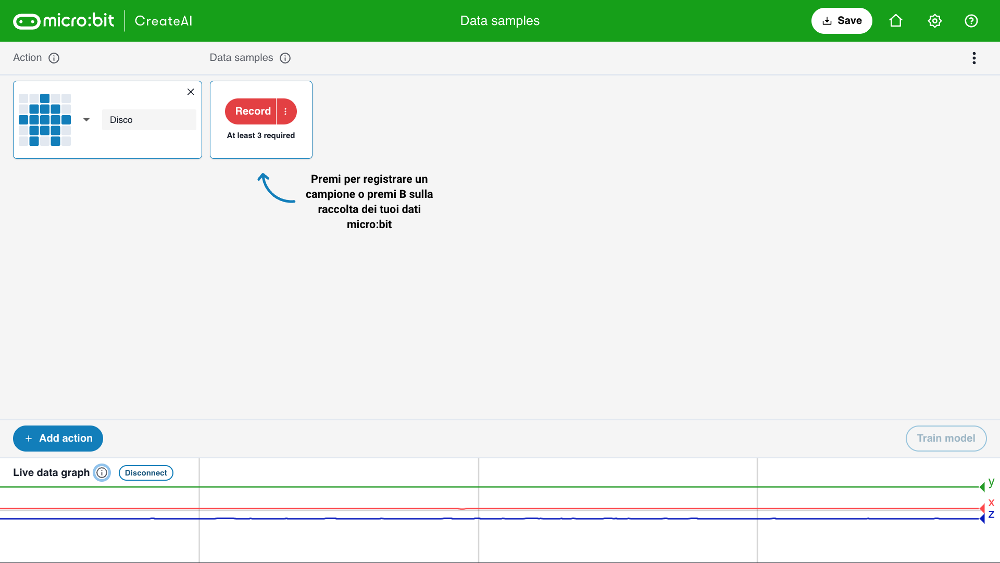
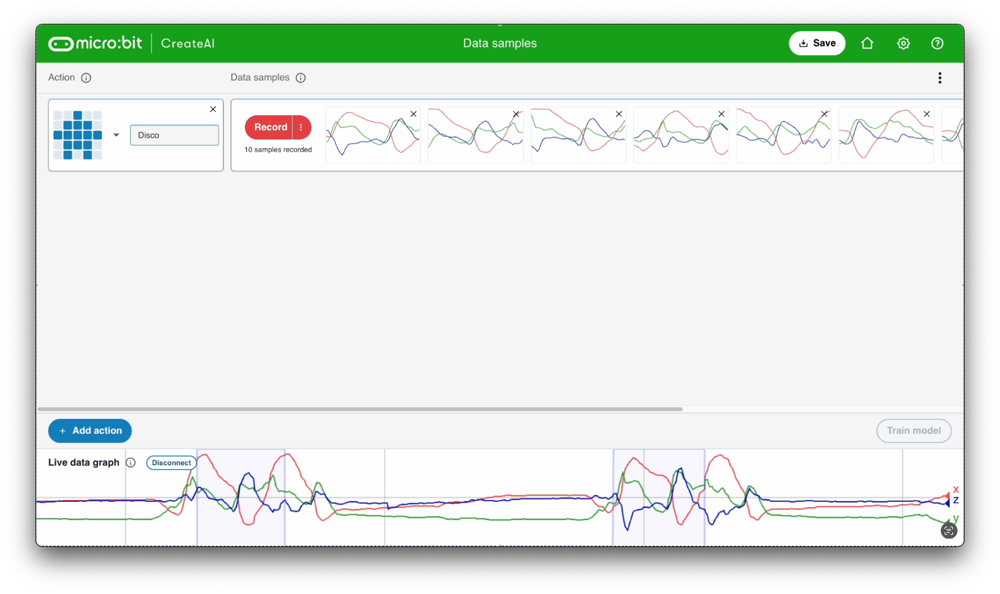

## Aggiungi campioni

<html>
  

    <iframe style="position: absolute; top: 0; left: 0; right: 0; width: 100%; height: 100%; border: none;" src="https://www.youtube.com/embed/wCOEoAI2X28?rel=0&cc_load_policy=1" allowfullscreen allow="accelerometer; autoplay; clipboard-write; encrypted-media; gyroscope; picture-in-picture; web-share"></iframe>
  

</html>

### Aggiungi un'azione

\--- task ---

Fai clic sul pulsante blu **+ Aggiungi azione**.

Dai un nome alla **prima** azione.

Nel nostro esempio utilizziamo il nome `Disco`.

\--- /task ---

### Aggiungere campioni di dati

È importante tenere sempre il micro:bit nella stessa posizione.

\--- task ---

Tieni il micro:bit e il pacco batteria insieme nella tua mano.

Ricorda come lo tieni. Assicurati di tenerlo nello stesso modo più avanti in questo progetto.

\--- /task ---

Ogni azione può durare 1 secondo.

\--- task ---

Premi il pulsante B, aspetta il conto alla rovescia, e poi esegui la prima azione da 1 secondo.

Questo esempio mostra un'azione `Disco`, ma puoi eseguire qualsiasi azione desideri!

<video width="360" height="640" controls>
  <source src="images/disco.mp4" type="video/mp4" alt="A video of young person recording samples of a dance move">
  
Il tuo browser non supporta tag video.
</video>

\--- /task ---

\--- task ---

Aggiungi altri campioni della tua prima azione, fino ad avere almeno **10 campioni**.

\--- /task ---

### Aggiungi una seconda azione

\--- task ---

Fai clic sul pulsante blu **+ Aggiungi azione**.

Dai un nome alla **prima** azione.

Nel nostro esempio utilizziamo il nome `Floss`.

\--- /task ---

\--- task ---

Aggiungi altri campioni della tua seconda azione, fino ad avere almeno **10 campioni**.

Questo esempio mostra un'azione `Floss`, ma puoi eseguire qualsiasi azione desideri!

<video width="360" height="640" controls>
  <source src="images/floss.mp4" type="video/mp4" alt="A video of young person recording samples of a dance move">
  
Il tuo browser non supporta tag video.
</video>

\--- /task ---
