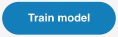

## Addestra il modello

<html>
  

    <iframe style="position: absolute; top: 0; left: 0; right: 0; width: 100%; height: 100%; border: none;" src="https://www.youtube.com/embed/2VC3gnPk3Zw?rel=0&cc_load_policy=1" allowfullscreen allow="accelerometer; autoplay; clipboard-write; encrypted-media; gyroscope; picture-in-picture; web-share"></iframe>
  

</html>

\--- task ---

Fai clic sul pulsante blu **Addestra modello**.

\--- /task ---

### Anteprima e test

Scopri se il tuo modello riesce a riconoscere i tuoi passi di danza!

\--- task ---

Esegui una delle tue azioni e scopri quale azione il tuo modello prevede (**stima**) che tu stia facendo.

Potrai visualizzare i punteggi di sicurezza (**certezza**) associati alle tue azioni.

\--- /task ---

<video width="640" height="360" controls>
  <source src="images/discotest.mp4" type="video/mp4" alt="A screen recording showing the estimated action during testing with an overlay of a boy performing the dance move">
  
Il tuo browser non supporta tag video.
</video>
