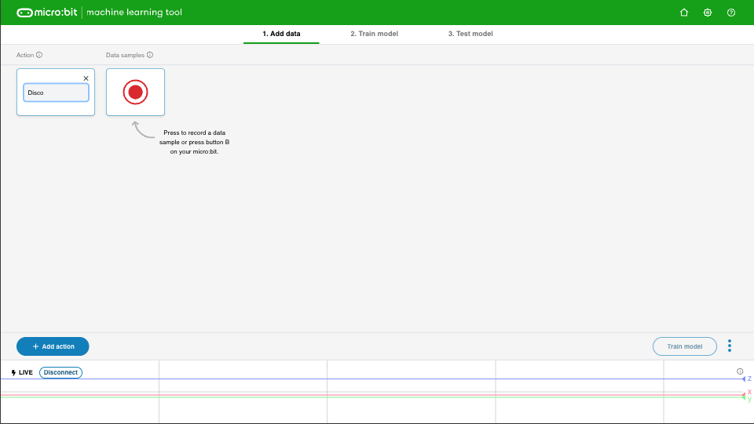

## Voeg voorbeelden toe

<html>
  

    <iframe style="position: absolute; top: 0; left: 0; right: 0; width: 100%; height: 100%; border: none;" src="https://www.youtube.com/embed/wCOEoAI2X28?rel=0&cc_load_policy=1" allowfullscreen allow="accelerometer; autoplay; clipboard-write; encrypted-media; gyroscope; picture-in-picture; web-share"></iframe>
  

</html>

### Een actie toevoegen

--- task ---

Geef de **eerste** actie een naam.

In ons voorbeeld gebruiken we de naam `Disco`.

--- /task ---

### Voeg data voorbeelden toe

Het is belangrijk dat je de micro:bit altijd op dezelfde manier vasthoudt.

--- task ---

Houd je micro:bit en batterijpakket samen in je hand.

**Onthoud** hoe je het vasthoudt. Zorg ervoor dat je het later in dit project precies op dezelfde manier vasthoudt.

--- /task ---

Elke actie kan 1 seconde duren.

--- task ---

Druk op knop B, wacht op het aftellen, en voer dan je eerste 1-seconde actie uit.

Dit voorbeeld toont een 'Disco' actie, maar je kunt ook zelf een beweging bedenken!

<video width="360" height="640" controls>
  <source src="images/disco.mp4" type="video/mp4" alt="A video of young person recording samples of a dance move">
Je browser ondersteunt de video tag niet.
</video>

--- /task ---

--- task ---

Voeg meer voorbeelden van je eerste actie toe, totdat je tenminste **10 voorbeelden** hebt.

--- /task ---

### Voeg een tweede actie toe

--- task ---

Klik op de blauwe knop **+ Add action**.

Geef de **tweede** actie een naam.

In ons voorbeeld gebruiken we de naam `Floss`.

--- /task ---

--- task ---

Voeg meer voorbeelden van je tweede actie toe, totdat je ten minste **10 voorbeelden** hebt.

Dit voorbeeld toont een 'Floss' actie, maar je kunt ook zelf een beweging bedenken!

<video width="360" height="640" controls>
  <source src="images/floss.mp4" type="video/mp4" alt="A video of young person recording samples of a dance move">
Je browser ondersteunt de video tag niet.
</video>

--- /task ---
