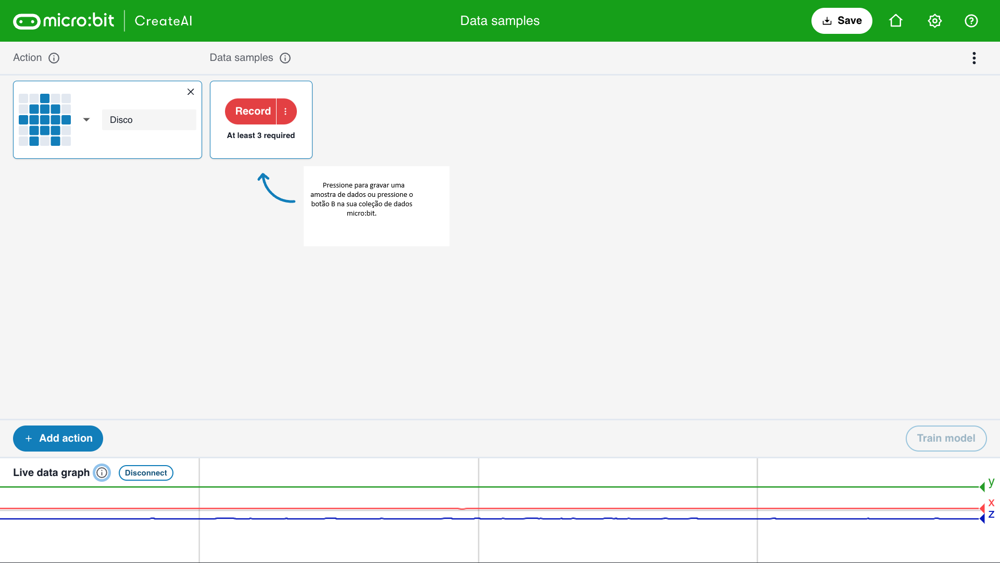

## Adicionar amostras

<html>
  

    <iframe style="position: absolute; top: 0; left: 0; right: 0; width: 100%; height: 100%; border: none;" src="https://www.youtube.com/embed/wCOEoAI2X28?rel=0&cc_load_policy=1" allowfullscreen allow="accelerometer; autoplay; clipboard-write; encrypted-media; gyroscope; picture-in-picture; web-share"></iframe>
  

</html>

### Adicionar uma ação

\--- task ---

Clique no botão azul **+ Adicionar ação**.

Nomeie a **primeira** ação.

Nosso exemplo usa o nome `Disco`.

\--- /task ---

### Adicionar amostras de dados

É importante que você sempre segure o micro:bit da mesma maneira.

\--- task ---

Segure o micro:bit e o pacote de bateria juntos na sua mão.

**Lembre-se** de como você o segurou. Certifique-se de segurá-lo assim mais adiante neste projeto.

\--- /task ---

Cada ação pode ter 1 segundo de duração.

\--- task ---

Pressione o botão B, aguarde a contagem regressiva e depois faça sua primeira ação de 1 segundo.

Este exemplo mostra uma ação `Disco`, mas você pode fazer qualquer ação que quiser!

<video width="360" height="640" controls>
  <source src="images/disco.mp4" type="video/mp4" alt="A video of young person recording samples of a dance move">
  
Your browser does not support the video tag.
</video>

\--- /task ---

\--- task ---

Adicione mais amostras de sua primeira ação, até você ter pelo menos **10 amostras**.

\--- /task ---

### Adicionar uma segunda ação

\--- task ---

Clique no botão azul **+ Adicionar ação**.

Nomeie a **segunda** ação.

Nosso exemplo usa o nome `Floss`.

\--- /task ---

\--- task ---

Adicione mais amostras de sua segunda ação, até você ter pelo menos **10 amostras**.

Este exemplo mostra uma ação `Floss`, mas você pode fazer qualquer ação que quiser!

<video width="360" height="640" controls>
  <source src="images/floss.mp4" type="video/mp4" alt="A video of young person recording samples of a dance move">
  
Your browser does not support the video tag.
</video>

\--- /task ---
