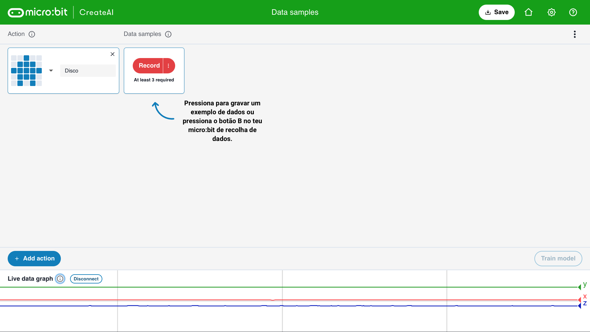

## Adiciona amostras

<html>
  

    <iframe style="position: absolute; top: 0; left: 0; right: 0; width: 100%; height: 100%; border: none;" src="https://www.youtube.com/embed/wCOEoAI2X28?rel=0&cc_load_policy=1" allowfullscreen allow="accelerometer; autoplay; clipboard-write; encrypted-media; gyroscope; picture-in-picture; web-share"></iframe>
  

</html>

### Adiciona uma ação

\--- task ---

Clica no botão azul **+ Adicionar ação**.

Nomeia a **primeira** ação.

O nosso exemplo usa o nome `Disco`.

\--- /task ---

### Adiciona dados de exemplo

É importante que segures o micro:bit sempre da mesma maneira.

\--- task ---

Segura o teu micro:bit e pacote de bateria juntos na tua mão.

**Lembra-te** como seguras. Certifica-te que o seguras assim mais tarde neste projeto.

\--- /task ---

Cada ação pode ter um 1 segundo de duração.

\--- task ---

Pressiona o botão B, espera pela contagem, e depois faz a tua primeira ação de 1-segundo.

Este exemplo mostra uma ação `Disco`, mas podes fazer outra ação que tu quiseres!

<video width="360" height="640" controls>
  <source src="images/disco.mp4" type="video/mp4" alt="A video of young person recording samples of a dance move">
  
O teu navegador não suporta a tag do vídeo.
</video>

\--- /task ---

\--- task ---

Adiciona mais exemplos da tua primeira ação, até teres pelo menos **10 exemplos**.

\--- /task ---

### Adiciona uma segunda ação

\--- task ---

Clica no botão azul **+ Adicionar ação**.

Renomeia a **segunda** ação.

O nosso exemplo usa o nome `Floss`.

\--- /task ---

\--- task ---

Adiciona exemplos da tua segunda ação, até teres pelo menos **10 exemplos**.

Este exemplo mostra a ação `Floss`, mas podes fazer outra ação que tu quiseres!

<video width="360" height="640" controls>
  <source src="images/floss.mp4" type="video/mp4" alt="A video of young person recording samples of a dance move">
  
O teu navegador não suporta a tag do vídeo.
</video>

\--- /task ---
