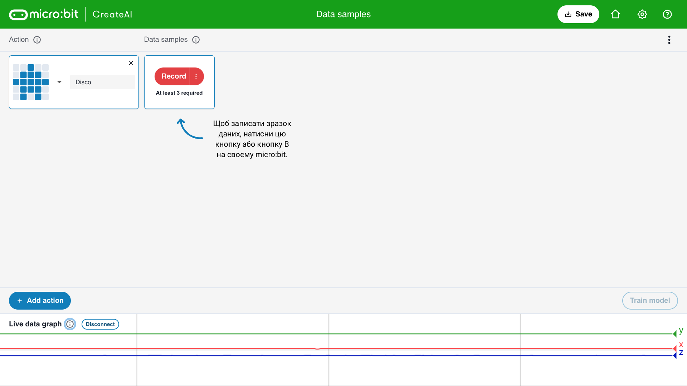

## Додай зразки

<html>
  

    <iframe style="position: absolute; top: 0; left: 0; right: 0; width: 100%; height: 100%; border: none;" src="https://www.youtube.com/embed/wCOEoAI2X28?rel=0&cc_load_policy=1" allowfullscreen allow="accelerometer; autoplay; clipboard-write; encrypted-media; gyroscope; picture-in-picture; web-share"></iframe>
  

</html>

### Додай рух

\--- task ---

Назви свій **перший** рух.

У нашому прикладі використовується назва «диско».

\--- /task ---

### Додай зразки даних

Важливо завжди тримати micro:bit однаково.

\--- task ---

Тримай micro:bit і акумулятор разом у руці.

**Запам’ятай**, як ти його тримаєш. Пізніше в цьому проєкті треба буде тримати його так само.

\--- /task ---

Кожен рух може тривати 1 секунду.

\--- task ---

Натисни кнопку B, дочекайся зворотного відліку, а потім виконай свій перший 1-секундний рух.

У цьому прикладі показаний рух «диско», але ти можеш виконати будь-який рух!

<video width="360" height="640" controls>
  <source src="images/disco.mp4" type="video/mp4" alt="A video of young person recording samples of a dance move">
  
Твій браузер не підтримує тег video.
</video>

\--- /task ---

\--- task ---

Додай більше зразків свого першого руху, поки не отримаєш принаймні **10 зразків**.

\--- /task ---

### Додай другий рух

\--- task ---

Натисни синю кнопку **+ Add action** («Додати рух»).

Назви **другий** рух.

У нашому прикладі використовується назва «флос».

\--- /task ---

\--- task ---

Додай більше зразків другого руху, поки не отримаєш принаймні **10 зразків**.

У цьому прикладі показаний рух «флос», але ти можеш виконати будь-який рух!

<video width="360" height="640" controls>
  <source src="images/floss.mp4" type="video/mp4" alt="A video of young person recording samples of a dance move">
  
Твій браузер не підтримує тег video.
</video>

\--- /task ---
