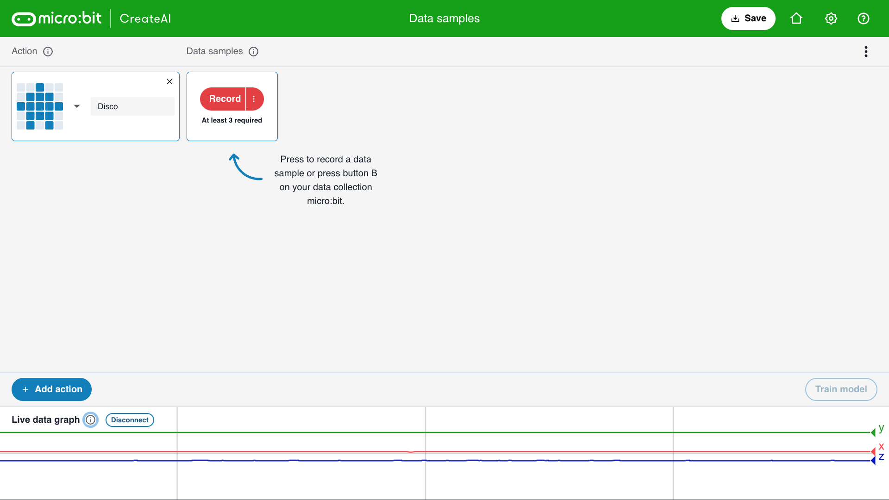
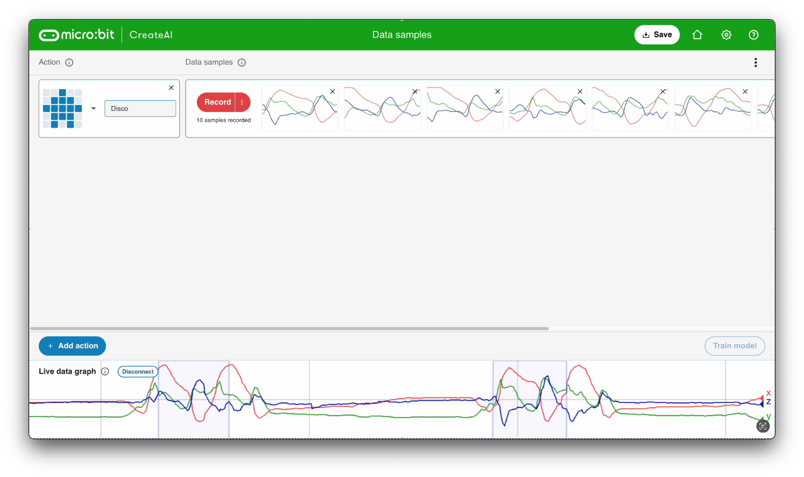

## Thêm mẫu

<html>
  

    <iframe style="position: absolute; top: 0; left: 0; right: 0; width: 100%; height: 100%; border: none;" src="https://www.youtube.com/embed/wCOEoAI2X28?rel=0&cc_load_policy=1" allowfullscreen allow="accelerometer; autoplay; clipboard-write; encrypted-media; gyroscope; picture-in-picture; web-share"></iframe>
  

</html>

### Thêm một hành động

\--- task ---

Nhấp vào nút **+ Thêm hành động** màu xanh lam.

Đặt tên cho hành động **đầu tiên**.

Ví dụ của chúng tôi sử dụng tên `Disco`.

\--- /task ---

### Thêm dữ liệu mẫu

Điều quan trọng là bạn phải luôn cầm micro:bit theo cùng một cách.

\--- task ---

Hold your micro:bit and battery pack together in your hand.

**Hãy nhớ** cách bạn cầm nó. Hãy đảm bảo bạn giữ nó như vậy ở phần sau của dự án này.

\--- /task ---

Mỗi hành động có thể kéo dài 1 giây.

\--- task ---

Nhấn nút B, đợi đếm ngược, sau đó thực hiện hành động trong 1 giây đầu tiên  của bạn.

Ví dụ này cho thấy hành động `Disco`, nhưng bạn có thể thực hiện bất kỳ hành động nào bạn muốn!

<video width="360" height="640" controls>
  <source src="images/disco.mp4" type="video/mp4" alt="A video of young person recording samples of a dance move">
  
Trình duyệt của bạn không hỗ trợ thẻ video.
</video>

\--- /task ---

\--- task ---

Thêm nhiều mẫu hơn cho hành động đầu tiên của bạn cho đến khi bạn có ít nhất **10 mẫu**.

\--- /task ---

### Thêm hành động thứ hai

\--- task ---

Nhấp vào nút **+ Thêm hành động** màu xanh lam.

Đặt tên cho hành động **thứ hai**.

Ví dụ của chúng tôi sử dụng tên `Floss`.

\--- /task ---

\--- task ---

Thêm các mẫu của hành động thứ hai cho đến khi bạn có ít nhất **10 mẫu**.

Ví dụ này cho thấy hành động `Floss`, nhưng bạn có thể thực hiện bất kỳ hành động nào bạn muốn!

<video width="360" height="640" controls>
  <source src="images/floss.mp4" type="video/mp4" alt="A video of young person recording samples of a dance move">
  
Trình duyệt của bạn không hỗ trợ thẻ video.
</video>

\--- /task ---
